<style>
* {align: right; max-width: 100%; text-align: justify;}
h1 {color: green;}
h2 {color: lightGreen;}
//li {color: #afafff;}
//p {color: white;}
img {width: 80%; margin-left: 10%}
.portada h6 {font-size: 50px; text-align: center; margin-top: 450px; margin-bottom: 500px;}
.portada p {font-size: 20px; text-align: right; margin-bottom: 15px;}
</style>

<div class="portada"><h6>Videojuego 2D</h6><p>Sergio Herrero Sanz - DAM2D</p></div>

# Videojuego 2D 

- [Videojuego 2D](#videojuego-2d)
  - [Descripción del videojuego](#descripci%c3%b3n-del-videojuego)
  - [Herramientas utilizadas](#herramientas-utilizadas)
  - [Diseño/Arquitectura del software](#dise%c3%b1oarquitectura-del-software)
    - [Ficheros](#ficheros)
      - [Animaciones](#animaciones)
      - [Gráficos (Sprites)](#gr%c3%a1ficos-sprites)
      - [Materiales](#materiales)
      - [Escenas](#escenas)
    - [Módulos y clases](#m%c3%b3dulos-y-clases)
      - [Controlador de la cámara](#controlador-de-la-c%c3%a1mara)
      - [Controlador del personaje](#controlador-del-personaje)
      - [Controlador de enemigos](#controlador-de-enemigos)
      - [Controlador de la puerta](#controlador-de-la-puerta)
      - [Controlador de la plataforma que pierde bloques](#controlador-de-la-plataforma-que-pierde-bloques)
      - [Elementos que causan daño (roca)](#elementos-que-causan-da%c3%b1o-roca)
      - [Menús](#men%c3%bas)
      - [GameManager](#gamemanager)
    - [Escenas](#escenas-1)
      - [MainMenu](#mainmenu)
      - [Level00](#level00)
      - [Level01](#level01)
      - [Level02](#level02)
      - [GameOver](#gameover)
    - [Recursos:](#recursos)
  - [Planificación](#planificaci%c3%b3n)
  - [Temporización real](#temporizaci%c3%b3n-real)
  - [Valoración de los resultados](#valoraci%c3%b3n-de-los-resultados)
  - [Defectos](#defectos)
  - [Bibliografía/Webgrafía](#bibliograf%c3%adawebgraf%c3%ada)
<br><br><br><br><br><br><br><br><br><br><br><br><br><br><br>
## Descripción del videojuego 
Este es un videojuego en dos dimensiones de los llamados "de plataformas". Consiste en alcanzar una puerta al siguiente nivel avanzando por un nivel con plataformas, trampas y enemigos a los que evitar.
* Plataforma del videojuego: Este juego ha sido desarrollado en Unity, por lo que se puede implementar en varias plataformas sin necesidad de realizar una gran cantidad de modificaciones, a pesar de ello su desarrollo ha sido orientado hacia PC y se compilará para Windows.
* Mecánica del videojuego: Para avanzar en el videojuego deberemos recorrer cada nivel buscando una puerta que nos llevará al nivel siguiente. En algunos niveles la puerta estará bloqueada y necesitaremos encontrar un interruptor que la desbloquee, en otros casos la puerta estará desbloqueada pero en el camino nos encontraremos con enemigos o plataformas trampa u ocultas. Consideraremos que nos habremos pasado el videojuego cuando lleguemos a la pantalla final.
* Manejo por parte del usuario: El personaje dispone de los controles básicos para moverse, atacar y saltar, una o varias veces seguidas dependiendo del nivel. Al ser un juego en 2D y no tener profundidad, el personaje solo se moverá hacia izquierda o derecha, y lo controlaremos con las flechas o con A y D (A para izquierda y D para derecha). Para saltar se presionará la flecha arriba o la letra W. En el caso de que el nivel permita saltar varias veces seguidas (en el aire), la cantidad de saltos se reestablecerá cada vez que se toque el suelo o una plataforma. Cada vez que se ataque, presionando la tecla Espacio, el personaje lanzará una roca que rebota en el suelo y desaparece a los 10 segundos, al alcanzar a un enemigo o al desaparecer de la pantalla.
* Diseño artístico y audio: Este juego está inspirado en Mario Bros, por lo que usa sprites y música retro (8-16 bits).
<!--TODO 1107-->
<div style="display:none;">b091t0</div>

## Herramientas utilizadas
* Kanban Tasker: Permite organizar el trabajo mediante metodologías ágiles. Funciona agregando tarjetas para cada tarea que se debe realizar y ubicándolas en una columna según su estado (en reserva, por hacer, en proceso, revisar y terminado) y según su prioridad (alta, normal y baja). De esta forma se puede ver el estado del proyecto de forma sencilla.


* Gimp: Editor gratuito de imágenes utilizado para retocar y crear sprites.

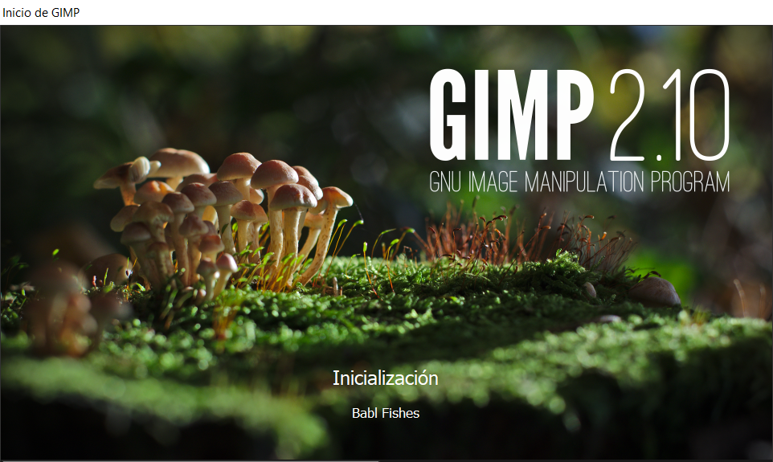

* Visual Studio Code: Editor de texto compatible con `Markdown` y `Mermaid` utilizado para escribir esta memoria y exportarla a PDF a través de extensiones:
  * Markdown All in One: Atajos de techado para Markdown.
  * Markdown PDF: Permite exportar los documentos a PDF, HTML, PNG y JPEG.
  * Markdown Preview Mermaid Support: Añade soporte para Mermaid


* Markdown: Lenguaje de marcado para texto plano que permite aplicar estilos de forma sencilla sin necesitar un editor específico. Fue creado para escribir páginas HTML de forma que fuese sencillo leer el texto fuente y por lo tanto acepta su sintaxis.
[Ver sintaxis de Markdown](https://github.com/adam-p/markdown-here/wiki/Markdown-Cheatsheet). 
[Ver página del creador](https://daringfireball.net/projects/markdown/). 
* Mermaid: Es un script de JavaScript que permite dibujar diagramas a usando la sintaxis de markdown. Permite generar diagramas de flujo, de secuencia, de Gantt, de clases, de estado, de tarta y mas. 
[Página oficial](https://mermaid-js.github.io/mermaid/#/).
* Mermaid Live Editor: Editor online de Mermaid usado para exportar los diagramas. [Abrir en el navegador](https://mermaidjs.github.io/mermaid-live-editor/).


* Visual Studio: IDE compatible con Unity para escribir scripts.


* Unity 3D: Motor gráfico.


## Diseño/Arquitectura del software

### Ficheros 
Todos los archivos usados para el desarrollo del programa ajenos al propio motor gráfico están ubicados en la carpeta `Assets`, y clasificados en carpetas según el tipo de archivo. La música esta en la carpeta `Audio`, las animaciones están guardadas en la carpeta `Animations` y a su vez en una carpeta propia para cada sprite, los sprites están guardados en la carpeta `Graphics`, los archivos de propiedades como materiales del motor de físicas o propiedades de otros elementos en la carpeta `Materials`, los objetos creados en el entorno de desarrollo en la carpeta `Prefabs`, cada uno de los niveles en `Scenes` y por último los scripts en la carpeta `Scripts`, ordenados a su vez en carpetas según qué tipo de objetos los utilizan.
```
├───Animations
│   ├───Bat
│   ├───Character
│   ├───Ghost
│   └───Spider
├───Audio
├───Graphics
├───Materials
├───Prefabs
│   ├───Background
│   ├───Characters
│   ├───Objects
│   └───Platforms
├───Scenes
└───Scripts
    ├───Cameras
    ├───Characters
    ├───Logic
    ├───Menus
    └───Physics
```
#### Animaciones
Para animar los sprites son necesarios como mínimo dos archivos: archivos de animación (.anim) y un archivo que controle como se comportan las diferentes animaciones (.controller).

Para crear una animación abrimos la ventana `Animation` y seleccionamos un objeto de tipo sprite de la escena que tengamos abierta. Arrastramos cada uno de los frames de la animación desde la vista de archivos y ajustamos la línea de tiempo para determinar cuanto será visible cada fotograma. Guardamos en un archivo y repetimos para cada animación.


Para mostrar las animaciones en la escena creamos un controlador desde la ventana `Animator`. Arrastramos las animaciones creadas en el paso anterior y desde la pestaña `parameters` declaramos las variables que mas adelante utilizaremos para decidir qué animación se debe de mostrar. Sobre cada una de las animaciones hacemos click derecho y seleccionamos 'Make Transition'. En la ventana `Inspector` declararemos las condiciones necesarias que se deben cumplir para cambiar de una animación a otra añadiéndolas desde el botón +. Elegiremos la variable y el valor que debe de tener. Los valores de las variables se modifican desde código puesto que son parte del objeto y el controlador se limita a leerlas. Creamos una transición en cada sentido para cada animación y guardamos el archivo.

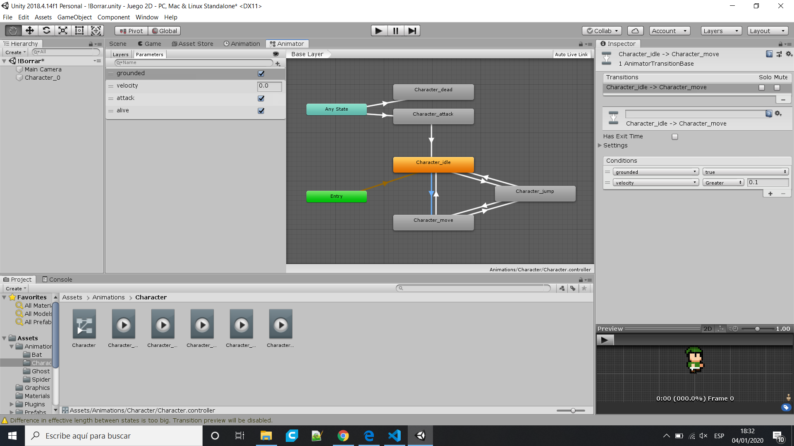

Para cambiar desde código las variables declaradas debemos de añadir un script al objeto en el que se controlará el valor de cada variable. Obtendremos el componente animator al comienzo de la ejecución y asignaremos el valor que queramos a cada variable.

```cs
private Animator anim;

void Start()
{
    anim = GetComponent<Animator>();
}

void Update()
{
    anim.SetFloat("velocity", 3);
    anim.SetBool("grounded", true);
    anim.SetBool("attack", false);
    anim.SetBool("alive", true);
}
```

#### Gráficos (Sprites)
Si la imagen que vamos a utilizar solo contiene un sprite bastará con arrastrar a la escena el archivo, si contiene varios sprites deberemos separarlos desde el editor.

Seleccionamos la imagen y cambiamos el 'Sprite Mode' a 'Multiple' en la pestaña `Inspector`. Hacemos click sobre el botón 'Sprite Editor' para abrir el editor y buscamos 'Slice' en la esquina superior izquierda. En la ventana que se abre pulsamos sobre 'Slice' y cerramos el editor. Ahora en la vista de archivos podemos ver que se permiten seleccionar como imágenes diferentes cada uno de los sprites.

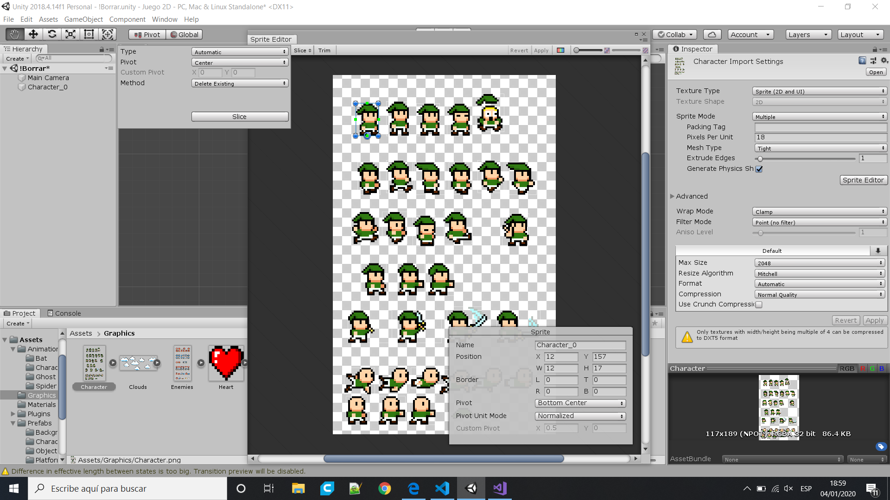

#### Materiales
Los objetos que trabajan con físicas pueden llevar un  PhysicMaterial2D que determina como se comportará al colisionar con otros objetos. Solo contiene dos valores que definen la fricción entre los objetos y el "rebote".

Para crear un material hacemos click derecho sobre la vista de archivos --> Create --> Phisycs Material 2D.

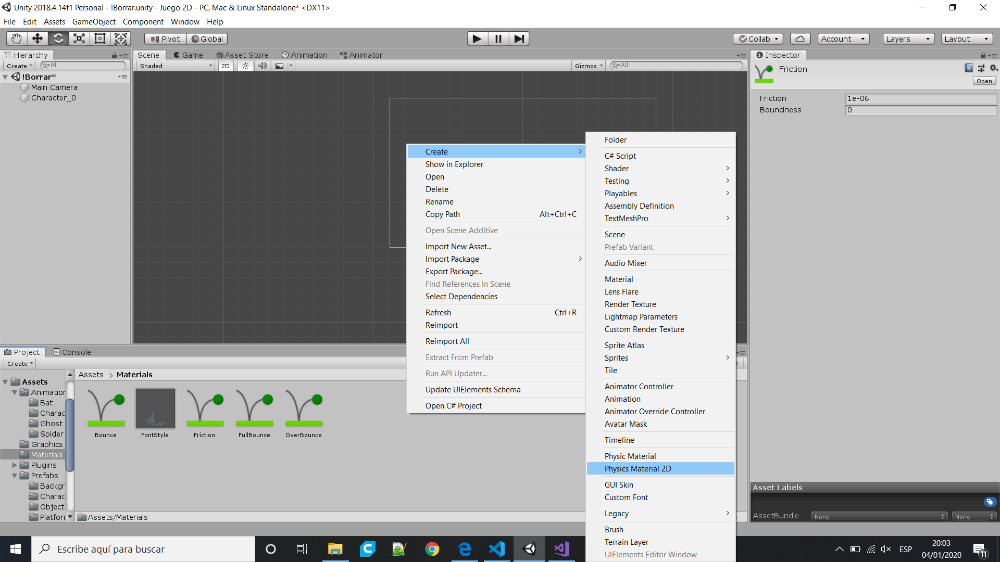

#### Escenas
Las escenas son cada uno de los diferentes niveles del videojuego. Contienen los objetos, a los que se les define una posición y diversos componentes. 

Para crear una escena hacemos click derecho sobre la vista de archivos --> Create --> Scene.

Para cambiar desde código la escena en la que nos encontramos usaremos la clase `SceneManager`.
```cs
SceneManager.LoadScene(SceneManager.GetActiveScene().buildIndex + 1);
```

### Módulos y clases


#### Controlador de la cámara
Estos scripts obtienen la posición del objeto introducido desde la ventana Inspector y desplazan la cámara a esa posición suavizando el movimiento según el parámetro `smoothTime`. En el caso de la clase `ConstrainedCameraController` se definen las coordenadas máximas y mínimas del cuadrado en el que se podrá desplazar la cámara, situando la misma en el límite si el objeto a  escapa de esa zona. La coordenada mínima debe corresponderse con la esquina inferior izquierda y la máxima con la esquina superior derecha.

En el método `Start()` se obtiene el objeto 'Player' y en el método `FixedUpdate()` se asigna a la propiedad de la cámara 'position' la posición del objeto 'Player'. En el caso de `ConstrainedCameraController` se utiliza la función `Mathf.SmoothDamp()` para suavizar el movimiento de la cámara.


#### Controlador del personaje
Hay dos scripts para el personaje, `PlayerIdleController` y `PlayerController`.

`PlayerIdleController` no nos permite controlarlo sino que establece los parámetros necesarios para activar la animación de espera para utilizar al personaje en el menú principal. En el método `Start()` se obtiene y asigna el componente 'Animator' y se da valor a las variables que necesita (velocity, grounded, attack y alive).

El script `PlayerController` lleva a cabo todo el control sobre el personaje, movimiento, vidas, saltos, ataque, etc. En el método `Start()` se obtienen los componentes del objeto y se establece la función `ResetPosition()` para que se ejecute al cambiar de escena. El método únicamente mueve el personaje a la posición (-6, -3, 0).

En el método `Update()` se asignan los parámetros necesarios para cambiar la animación y se comprueba si ha presionado la barra espaciadora para ejecutar el método `Attack()`. Esta función instancia el prefab de la roca, lo desplaza al lado del personaje (según a que lado mira) y le añade velocidad en un eje para que se mueva. 

En el método `FixedUpdate()` se computa la lógica de movimiento del personaje. Se comprueban los ejes de entrada y se mueve al personaje o se le hace saltar en función de sus valores. Para saltar se inicia la corrurina `Jump()`, que añade una fuerza hacia arriba y se decrementa la cantidad de saltos restantes.

En los métodos que detectan colisiones y triggers de reducen las vidas al colisionar contra un enemigo, llamando al método `Harm()`, que reduce la cantidad de vidas y vuelve al personaje translúcido e inmune a daño durante unos segundos. En estos métodos también se realiza alguna lógica para el correcto funcionamiento de los saltos e interacción con las plataformas.  


#### Controlador de enemigos
Este script mueve al enemigo al que se le aplica de derecha a izquierda en un área predefinida, cambiando de sentido cuando se alcanza un límite. Solo actúa sobre el eje horizontal. Además "mata" al enemigo cuando detecta una colisión con un objeto etiquetado como `DamageItem` y lo resucita tras el tiempo especificado por `deadTime` (en segundos). Definimos el rango en el que se mueve con `maxPos` y `minPos` y controlamos su velocidad con `speed`.

Una vez obtenidos los componentes 'Rigidbody2D' y 'Animator' en el método `Start()` y establecer los parámetros de la animación en el método `Update()` establecemos la lógica de movimiento en `FixedUpdate()`. Si la posición en el eje X alcanza uno de los límites invertimos el valor de la velocidad y de la escala en el eje X (Cambiar la orientación del sprite como si se tratase de un espejo). Para tratar con las colisiones utilizamos el método `OnTriggerEnter2D()`, si la colisión se corresponde con un objeto etiquetado como "DamageItem" se ejecuta la corrutina `Resurrect()`. En esta corrutina, que recibe el tiempo que va a permanecer el enemigo inactivo (muerto) por parámetro, bloqueamos el movimiento y cambiamos su etiqueta por "DeadEnemy" (Para que no cause daño al jugador) y establecemos el booleano `isAlive` a `false` para que cambie la animación. Después de esperar el tiempo indicado, volvemos a desbloquear el movimiento, establecemos el booleano a `true` y restauramos el valor de la etiqueta. 
Los métodos IEnumerator permiten ejecutarse en paralelo al hilo principal y parar su ejecución varias veces con:
```cs
yield return new WaitForSeconds();
``` 


#### Controlador de la puerta
La puerta puede funcionar de dos maneras distintas, utilizando el prefab `NextLevelToggle` (puerta desbloqueada) y el Script `NextLevelDoor` o utilizando todos los scripts y el prefab `NextLevelButtonDoor`.

La puerta desbloqueada captura la tecla W y Flecha arriba (Eje vertical) y cambia la escena a siguiente indicada en el índice de construcción del videojuego (buildIndex) cuando se presiona una de las dos y el personaje está en contacto con la puerta. Lo hará en el método `OnTriggerStay2D()`.

La puerta bloqueada es mas complicada. Para funcionar debe de tener un objeto padre que contenga en su interior el botón, la puerta bloqueada y la puerta desbloqueada. El botón deberá contener en su interior a su vez un botón presionado y otro sin presionar. El elemento padre debe contener el script `NextLevelController`, la puerta desbloqueada `NextLevelToggle` y el botón `PressButtonEventController`.

El script `NextLevelController` no recibe parámetros, obtiene las puertas en el método `Start()` y desactivara la puerta desbloqueada. Únicamente activará la puerta desbloqueada y desactivará la bloqueada cuando reciba una llamada al método `UnlockDoor()`.

El script `PressButtonEventController` obtiene los botones presionado y liberado, estableciendo como activo el botón liberado y desactivado el botón presionado en el método `Start()`, invirtiendo los valores cuando se detecta una colisión en el método `OnTriggerEnter2D()` y llamando al método `UnlockDoor()` del script `NextLevelController` del padre, obtenido también en el método `Start()`.


#### Controlador de la plataforma que pierde bloques
Este objeto esta compuesto por varios sprites independientes, con su propio collider y rigidbody. Cada uno de esos sprites aplica el script `FallingGroundController` y el padre utiliza `FallingCascadeController`.

El script `FallingGroundController` detecta una colisión con el método `OnCollisionEnter2D()` y, si se el causante es 'Player' permite a la gravedad actuar en el elemento al que se aplica, y llama al método `WarnNeighbour()` del script `FallingCascadeController` introducido por parámetro. Para activar la gravedad se elimina la restricción sobre el eje X del elemento 'Rigidbody2D'. Una vez activada la gravedad se utilizará la siguiente colisión para destruir el objeto.

El script `FallingCascadeController` toma como parámetros los scripts de los sprites independientes como un array y, cuando un script llama a su método `WarnNeighbour()`, fuerza la caída de los sprites colindantes llamando al método `ForceFall()` de la clase `FallingGroundController`.


#### Elementos que causan daño (roca)
Este script no toma parámetros y se limita a destruir al objeto que lo contiene cuando detecta una colisión contra un enemigo (vivo o muerto) o contra el personaje, o cuando deja de verse en pantalla.

Detecta las colisiones con el jugador con el método `OnCollisionEnter2D()` , las colisiones con los enemigos (como triggers) en el método `OnTriggerEnter2D()` y detecta cuando desaparece el objeto de la pantalla con `OnBecameInvisible()`.


#### Menús
Los scripts de los menús contienen métodos que utilizarán los botones del menú para realizar acciones.

El menú principal utiliza el script `MainMenuController`, que hace visible el cursor nada mas crearse en el método `Start()`. Define el método `onPlayClick()` para comenzar a jugar, que oculta el cursor y carga la escena inicial y el método `onQuitClick()`, que cierra el videojuego. Además, se define el método `onRunnerClick()` que lanzará la escena 'Runner' cuando sea desarrollada.

Durante la ejecución del videojuego se necesita un menú que permita salir, reiniciar el nivel y silenciar la música. `RunningMenuController` establece los métodos necesarios para que los botones realicen acciones y captura la pulsación de la tecla escape en el método `Update()` para mostrar u ocultar el menú, que se oculta al inicio en el método `Start()`. Entre todos sus métodos destacamos `onRestartClick()`, que obtiene el objeto `Player` y establece sus vidas a 3 antes de reiniciar la escena. Cada vez que se muestra y oculta el menú se pausa la escala de tiempo y se muestra u oculta el cursor.

El script `ScoreController` obtiene el componente 'TextMeshProUGUI' del 'TextMeshPro' al que se le aplica el script en el método `Start()` e inicia la corrutina `ReduceScore()`, que comienza a contar el tiempo transcurrido y lo muestra en el `TextMeshProUGUI` obtenido a través de la propiedad 'text'. Además establece la función SaveScore para que se ejecute cada vez que se cambie la escena, así se añade el tiempo transcurrido en una variable separada y se resetea a 0 el contador.

El Script `LivesController` funciona de forma similar a `ScoreController`. En el método `Start()` obtiene su `TextMeshProUGUI` y el Player, al que accede cada frame desde el método `FixedUpdate()` para mostrar el numero de vidas restantes.

`GameOverController` ejecuta código únicamente desde el método `Start()` en su creación. Establece el cursor como visible, obtiene los objetos 'Lives' y 'Score' y sus scripts y muestra la puntuación total, justo antes de destruirlos para que no sean visibles.


#### GameManager
Se trata de un objeto que controla el funcionamiento de algunos objetos. En este caso establece como 'no destruibles' al personaje, el controlador de audio, el menú de pausa y a si mismo, para que no se eliminen al cambiar de escena.
Se realiza toda la ejecución en el método `Start()`, donde se obtienen los objetos y se definen como no destruibles con el método `DontDestroyOnLoad()`. Además define una función que se ejecutará cada vez que se cambie de escena y eliminará los objetos previamente definidos como 'no destruibles' cuando se vuelva al menú inicial.


### Escenas
El juego se basa únicamente en un menú, dos niveles y la pantalla de fin, puesto que esta sin terminar. Además de esos niveles existe una escena adicional utilizada para probar los diferentes componentes que se van creando durante el desarrollo y que el usuario final no verá.

#### MainMenu
El menú consiste en un sprite animado del personaje sobre una plataforma, con nubes moviéndose detrás de éste y un menú a su lado. El menú está controlado por el script `MainMenuController` y contiene los botones "Jugar', "Runner" y "Salir". "Jugar" llama al método `onPlayClick()`, "Runner" a `onRunnerClick()` y "Salir" a `onQuitClick`. 

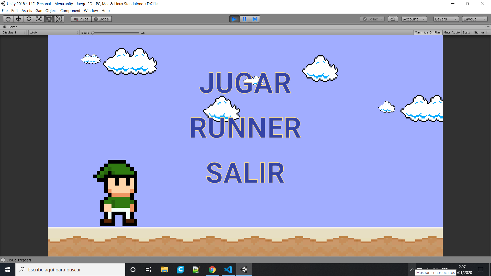)

#### Level00
Esta escena se utiliza para definir ciertos objetos como 'constantes' a lo largo de todo el videojuego y no para jugar como tal. Contiene el personaje, un objeto que reproduce el audio, el menú de pausa y el GameManager. 

Todos los niveles contienen un menú que permite realizar acciones y mostrar información. El presionar la tecla escape se pausará el juego y se mostrará un menú con tres botones "Reiniciar", "Volver al menú" y "Salir". Reiniciar llamará al método `onRestartClick()` del script `RunningMenuController`, "Volver al menú" llamará a `onReturnMenuClick()` y "Salir" a `onQuitClick()`. En todo momento se mostrará el tiempo transcurrido desde el comienzo de la escena y las vidas restantes. Estos elementos contendrán los scripts `ScoreController` y `LifesController` para actualizar sus valores.

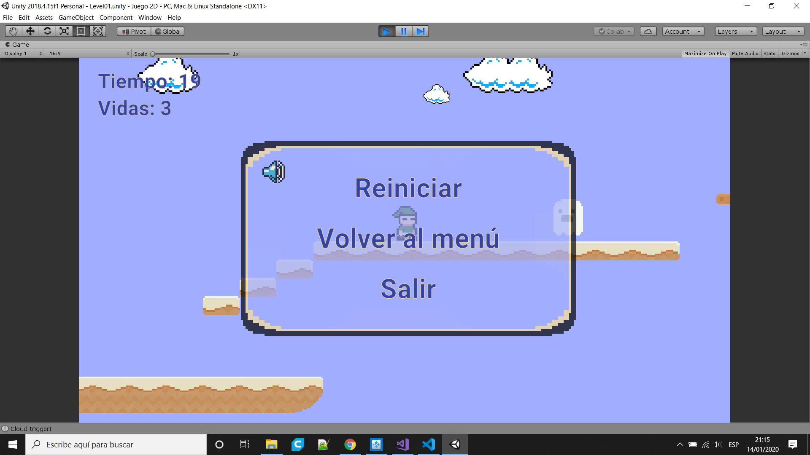

#### Level01
El primer nivel consiste en plataformas que conducen al personaje a la puerta que lo llevará al siguiente nivel. Hay una plataforma trampa que no contiene colisionador (por lo que es atravesable), otras que actúan como una cama elástica y por último enemigos "custodiando" la puerta.


#### Level02
El segundo nivel consiste en unas plataformas que actúan como una cama elástica entre las que hay que avanzar verticalmente hasta alcanzar un botón que desbloquea la última puerta del videojuego y conduce de vuelta al menú.


#### GameOver
La pantalla de fin muestra a través de un menú el tiempo total que se ha tardado en completar el videojuego y nos da las opciones "Volver al inicio" y "Salir". "Volver al inicio" llama al método `onReturnMenuClick()` del script `RunningMenuController` y "Salir" a `onQuitClick()`. Además podemos seguir moviendo al personaje en esta pantalla a pesar de que no contiene ninguna plataforma.

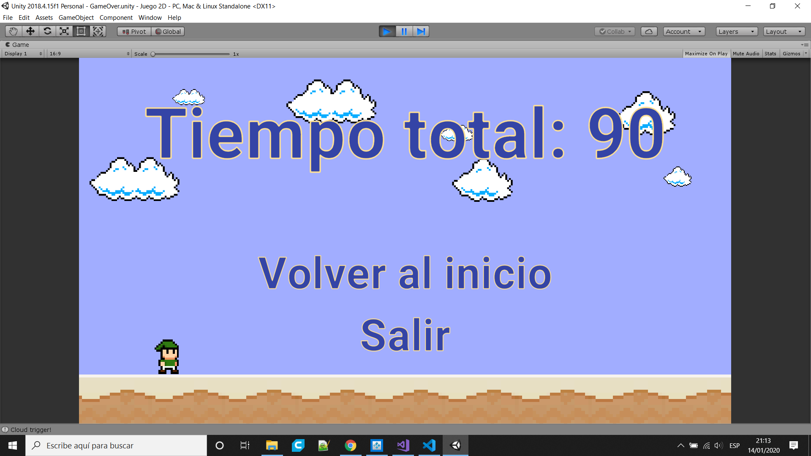

### Recursos:
En la documentación se pueden encontrar los links a los diferentes sprites utilizados. A excepción del proyectil (una roca) y la interfaz del menú de pausa todos han sido obtenidos de internet a pesar de que hayan sido modificados levemente:
* Character: Contiene los sprites necesarios para realizar la animación de espera, movimiento, salto y ataque (no utilizada).
* Clouds: Contiene dos modelos de nubes
* Heart: Corazón para mostrar las vidas restantes.
* Menu: Es el fondo del menú de pausa.
* Rock: Elemento que lanza el jugador.
* Speaker: Icono para activar/desactivar la música en el menú de pausa.
* Sprites: Sprites varios con las plataformas, algunos enemigos y objetos.
* Audio: Música retro que se reproducirá en bucle

## Planificación
La idea era empezar con mucho tiempo (noviembre) y trabajar en fragmentos del proyecto cuando me apeteciese, empezar por familiarizarme con Unity y su API y entonces desarrollar las funcionalidades básicas (movimiento del personaje y nivel demo) e ir añadiendo funcionalidades independientes según fuese avanzando el tiempo (crear objetos, plataformas y scripts para guardarlos como 'prefabs' y utilizarlos mas tarde) hasta finalmente utilizarlos en diferentes niveles, reservando la última semana para retoques y la documentación. En el hipotético caso de terminar con mucho tiempo de sobra añadiría una modalidad de juego adicional, convirtiendo este juego de plataformas en un 'runner'.

## Temporización real 
07/11/2019 - 14/11/2019:

1. Crear una escena "Demo" en la que trabajar (Demo.scene)
2. Dividir el sprite de las plataformas (Sprites.png) y crear una plataforma con colliders (Suelo09x1.prefab)
3. Añadir animaciones para el personaje y para los enemigos (Spider y Ghost, Bat nunca se llegó a utilizar)
4. Crear el personaje principal añadiendo el sprite (Character.png) y un script para controlar el movimiento (PlayerController.cs, sin saltos ni ataque)
5. Añadir un script a la cámara para que siguiese al personaje. (ConstrainedCameraController.cs y FreeCameraController.cs)
6. Añadir salto al personaje
7. Crear el script para controlar a los enemigos (EnemyXController.cs) y guardar el prefab terminado (Spider.prefab y Ghost.prefab)

14/12/2019 - 21/12/2019:

8. Crear un menú de inicio (Menu.scene)
9. Añadir al menú un personaje animado en una plataforma (IdlePlayer.prefab, PlayerIdleController.cs)
10. Añadir al menú un fondo de nubes en movimiento (MovingClouds.prefab, InfiniteMovementController.cs)
11. Crear plataforma a la que se le caen bloques (FallingGroundController.cs)
12. Crear script adicional para la plataforma anterior que causa que los bloques colindantes se caigan en cascada (FallingCascadeController.cs)

17/12/2019 - 21/12/2019:

13. Añadir puerta para cambiar de nivel (NextLevelDoor.prefab, NextLevelDoor.cs)
14. Cerrar la puerta y añadir botón para abrirla (NextLevelButtonDoor.prefab, NextLevelController.cs, PressButtonEventController.cs)
15. Añadir ataque al personaje (Rock.png)
16. Añadir menú de pausa para la tecla ESC (RunningMenu.prefab, RunningMenuController.cs, Menu.png)

21/12/2019 - 28/12/2019:

17. Guardar las plataformas utilizadas como prefabs.
18. Añadir niveles (Level00.scene, Level01.scene, Level02.scene)
    
04/01/2020 - 14/01/2020:

19. Sistema de puntuaciones (ScoreController.cs)
20. Visualización de vidas restantes y tiempo transcurrido (ScoreController.cs, LivesController.cs)
21. Pantalla final (GameOver.scene, GameOverController.cs)
22. Revisión, optimización y comentado de código
23. Documentación  

## Valoración de los resultados
No estoy del todo contento con el resultado. El primer día debí de planificar cuales eran los objetos que iban a formar parte del proyecto, diseñar las clases y dibujar los diagramas para tener claro como debía de hacerlo. En mi defensa diré que al no conocer la API de Unity y no estar familiarizado de ella era prácticamente imposible. Estaba tan perdido que no sabía ni si era posible comunicar los diferentes objetos de la escena entre sí, cosa que ahora veo evidente.

Respecto a la parte del 'núcleo' del videojuego (movimiento del personaje y nivel demo) estoy bastante contento, apenas tardé una semana en llevarlos a cabo y funcionan perfectamente (excepto el salto).

El mayor error que cometí en el desarrollo del videojuego, además de la falta de planificación, fue no percatarme de los verdaderos elementos necesarios en cualquier videojuego y que no abordé hasta el final o no tuve tiempo para realizar (menú de pausa, menú principal, audio, sistema de puntuaciones). Personalmente preferiría un proyecto con todo lo básico programado aunque no tuviese niveles propiamente dichos.

Otro de los grandes defectos que veo es un código desorganizado. Si pudiese repetir el proyecto extraería en métodos muchas de las funcionalidades, sobre todo en el script que controla al personaje, y hubiera utilizado los métodos del ciclo de vida para llamar a mis propios métodos en lugar de programar en su interior. A día de hoy (11/01/2020) voy a intentar corregir estos fallos y otros que no he nombrado para entregar el proyecto como considero que deberia ser.

A pesar de todos los defectos ya nombrados considero que al no haber usado assets ni extensiones es comprensible no haber podido completar todo a tiempo.

Resumiendo, debo mejorar la planificación.

## Defectos
* Salto: Es infinito
* Darse de cabeza con una plataforma al saltar: Al detectar la colisión con un objeto etiquetado como 'grounded' la animación detecta que esta encima de la plataforma y cambia la animación de salto.
* Saltos en plataforma elástica: El salto funciona estableciendo la velocidad del eje vertical a 0 y añadiendo una fuerza al personaje cuando se pulsa la tecla de salto, por lo tanto, si el personaje iba a alcanzar una posición mas alta que la que alcanzaría sin saltar, la plataforma elástica, que te hace rebotar hasta la posición vertical mas alta que has alcanzado, olvidará la posición mas alta y la sustituirá por la última, devolviendo al personaje a una posición mas baja de lo que debería.
* Rebotes en plataforma elástica: Cuando el personaje esta situado entre dos plataformas elásticas (una encima y otra debajo) y alcanza a rebotar a la superior, esta le devolverá rebotado hacia abajo, y la de abajo hacia arriba, creando un ciclo que aumenta cada vez más la velocidad haciendo incontrolable al personaje.

## Bibliografía/Webgrafía

Implementado:
* [Movimiento del personaje (físicas), escenario y animaciones (vídeos 1-10)](https://www.youtube.com/playlist?list=PLiplYDjUMtti5bWJ1Ugystr-vUg8B5EuP)
* [Crear un terreno o cielo en perpetuo movimiento I](https://www.youtube.com/watch?v=MRThXOxOcuE&t=20s), [II](https://www.youtube.com/watch?v=xAmyzWeEde4)
* [Parar el videojuego](https://answers.unity.com/questions/1230216/a-proper-way-to-pause-a-game.html)
* [Ocultar un elemento al presionar una tecla](https://answers.unity.com/questions/850220/how-can-i-get-a-ui-canvas-to-hideappear-on-esc-but.html)
* [Lanzar proyectiles](https://www.youtube.com/watch?v=zAgAxrTCbGM)
* [Instanciar objetos](https://forum.unity.com/threads/shooting-fireballs.230769/)
* [Destruir objetos](https://docs.unity3d.com/es/530/ScriptReference/Object.Destroy.html)
* [Corrutinas IEnumerator (equivalente a un hilo paralelo)](https://docs.unity3d.com/ScriptReference/WaitUntil.html)
* [Solucionar error: Ejecución empezaba parada](https://answers.unity.com/questions/171656/timetimescalet-to-0-whenever-i-start.html)
* [Cambiar de escena](https://docs.unity3d.com/ScriptReference/SceneManagement.SceneManager.html)
* [Silenciar audio](https://answers.unity.com/questions/52109/how-do-i-mute-all-audio-sound.html)
* [Cambiar texto en un menú](http://digitalnativestudios.com/forum/index.php?topic=1082.0)
* [Heredar objetos de una clase a otra (no destruirlos)](https://answers.unity.com/questions/734445/scripts-in-other-scenes-still-executing.html)
* [Ejecutar una función al cambiar de escena](ttps://docs.unity3d.com/ScriptReference/SceneManagement.SceneManager-activeSceneChanged.html)


No implementado:
* [Generar terreno aleatorio](https://www.youtube.com/watch?v=VkGG9Umag0M)

Recursos:
* [Sprite personaje, enemigos y plataformas](https://drive.google.com/file/d/1g6Pytql6h1gFt5WiMpdrV23jvrY2shtU/edit)
* [Sprite nubes](http://www.llumac.cat/picsl/799062/)
* [Sprite altavoz](https://www.shutterstock.com/es/image-vector/audio-speaker-volume-sound-button-retro-1340123576?id=1340123576&irgwc=1&utm_medium=Affiliate&utm_campaign=Freepik%20Company%2C%20S.L.&utm_source=39422&utm_term=5e19f8cf61855.5e19f8cf61856)
* [Audio](https://www.playonloop.com/2018-music-loops/follow-me/)

Solo se ha usado el antipatrón en los scripts de movimiento del personaje y de la cámara.