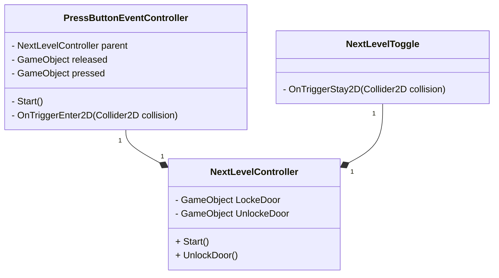

```mermaid
classDiagram

PressButtonEventController "1" --* "1" NextLevelController
NextLevelToggle "1" --* "1" NextLevelController

class NextLevelController{
    - GameObject LockeDoor
    - GameObject UnlockeDoor
    + Start()
    + UnlockDoor()
}
class PressButtonEventController{
    - NextLevelController parent
    - GameObject released
    - GameObject pressed
    - Start()
    - OnTriggerEnter2D(Collider2D collision)
}
class NextLevelToggle{
    - OnTriggerStay2D(Collider2D collision)
}
```