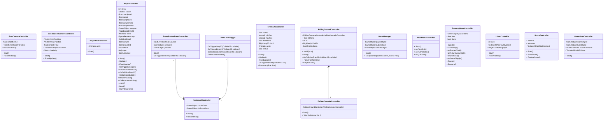

```mermaid
classDiagram

class FreeCameraController {
    - float smoothTime
    - Transform ObjectToFollow
    - Vector2 velocity
    ~ Start()
    ~ FixedUpdate()
}
class ConstrainedCameraController{
    - Vector2 minPosition
    - Vector2 maxPosition
    - float smoothTime
    - Transform ObjectToFollow
    - Vector2 velocity
    ~ Start()
    ~ FixedUpdate()
}

class PlayerIdleController{
    - Animator anim
    ~ Start()
}
class PlayerController{
    + int lives
    - Vector3 spawn
    - float maxSpeed
    - float speed
    - float jumpPower
    - float inmuneTime
    - float jumpNumber
    - GameObject weapon
    - Rigidbody2D rb2d
    - Animator anim
    - SpriteRenderer spr
    - Collider2D coll
    - bool inmune
    - bool grounded
    - bool attack
    - int jumps
    - bool unlocked
    ~ Start()
    ~ Update()
    ~ FixedUpdate()
    ~ OnTriggerEnter2D()
    ~ OnCollisionEnter2D()
    ~ OnCollisionStay2D()
    ~ OnCollisionExit2D()
    + ResetPosition()
    ~ OnBecameInvisible()
    ~ Jump()
    - Attack()
    ~ Harm(float time)
}

PressButtonEventController "1" --* "1" NextLevelController
NextLevelToggle "1" --* "1" NextLevelController
class NextLevelController{
    - GameObject LockeDoor
    - GameObject UnlockeDoor
    + Start()
    + UnlockDoor()
}
class PressButtonEventController{
    - NextLevelController parent
    - GameObject released
    - GameObject pressed
    - Start()
    - OnTriggerEnter2D(Collider2D collision)
}
class NextLevelToggle{
    - OnTriggerStay2D(Collider2D collision)
}

class EnemyXController{
    - float speed
    - Vector2 minPos
    - Vector2 maxPos
    - float deadTime
    - Rigidbody2D rb2d
    - Animator anim
    - bool isAlive
    ~ Start()
    ~ Update()
    ~ FixedUpdate()
    - OnTrigerEnter2D(Collider2D col)
    ~ Resurrect(float time)
}

FallingGroundController "n" *-- "1" FallingCascadeController

class FallingGroundController{
    - FallingCascadeController fallingCascadeController
    + float fallTime
    - int id
    - Rigidbody2D rb2d
    - bool firstCollision
    + setId(int id)
    - Start()
    - OnCollisionEnter2D(Collision2D collision)
    + ForceFall(float time)
    - Fall(float time)
}
class FallingCascadeController{
    - FallingGroundController[] fallingGroundControllers
    - Start()
    + WarnNeighbour(int i)
}

class GameManager{
    - GameObject playerObject
    - GameObject audioObject
    - GameObject canvasObject
    ~ Start()
    + Excepciones(Scene current, Scene next)
}

class MainMenuController{
    + Start()
    + onPlayClick()
    + onRunnerClick()
    + onQuitClick()
}
class RunningMenuController{
    - GameObject pauseMenu
    - float lives
    - bool show
    ~ Update()
    - OnDestroy()
    + onRestartClick()
    + onReturnMenuClick()
    + onQuitClick()
    + onSoundToggle()
    + Pause()
    + Resume()
}
class LivesController{
    - int lives
    - TextMeshProUGUI livestext
    - PlayerController player
    ~ Start()
    ~ FixedUpdate()
}
class ScoreController{
    + int time
    + int score
    - TextMeshProUGUI timetext
    ~ Start()
    + SaveScore()
    ~ ReduceScore()
}
class GameOverController{
    - GameObject scoreObject
    - GameObject livesObject
    - ScoreController scoreController
    - TextMeshProUGUI text
    ~ Start()
}

class NextLevelToggle{
    - OnTriggerEnter2D(Collider2D collision)
    - OnCollisionEnter2D(Collision2D collision)
    - OnBecameInvisible()
}
```