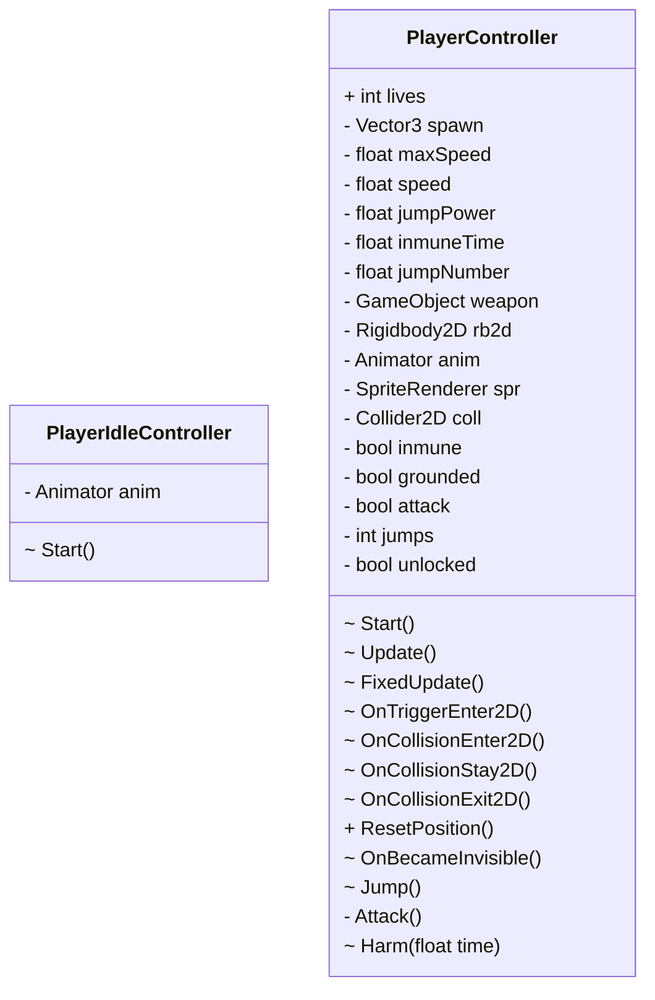

```mermaid
classDiagram

class PlayerIdleController{
    - Animator anim
    ~ Start()
}
class PlayerController{
    + int lives
    - Vector3 spawn
    - float maxSpeed
    - float speed
    - float jumpPower
    - float inmuneTime
    - float jumpNumber
    - GameObject weapon
    - Rigidbody2D rb2d
    - Animator anim
    - SpriteRenderer spr
    - Collider2D coll
    - bool inmune
    - bool grounded
    - bool attack
    - int jumps
    - bool unlocked
    ~ Start()
    ~ Update()
    ~ FixedUpdate()
    ~ OnTriggerEnter2D()
    ~ OnCollisionEnter2D()
    ~ OnCollisionStay2D()
    ~ OnCollisionExit2D()
    + ResetPosition()
    ~ OnBecameInvisible()
    ~ Jump()
    - Attack()
    ~ Harm(float time)
}
```