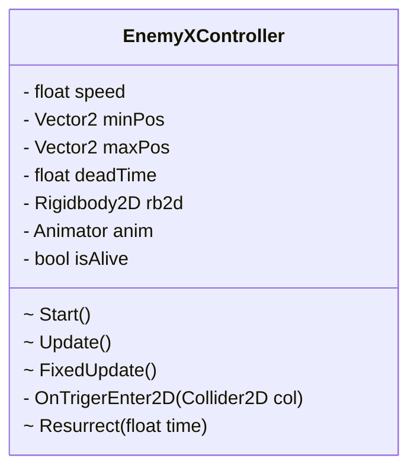

```mermaid
classDiagram

class EnemyXController{
    - float speed
    - Vector2 minPos
    - Vector2 maxPos
    - float deadTime
    - Rigidbody2D rb2d
    - Animator anim
    - bool isAlive
    ~ Start()
    ~ Update()
    ~ FixedUpdate()
    - OnTrigerEnter2D(Collider2D col)
    ~ Resurrect(float time)
}
```