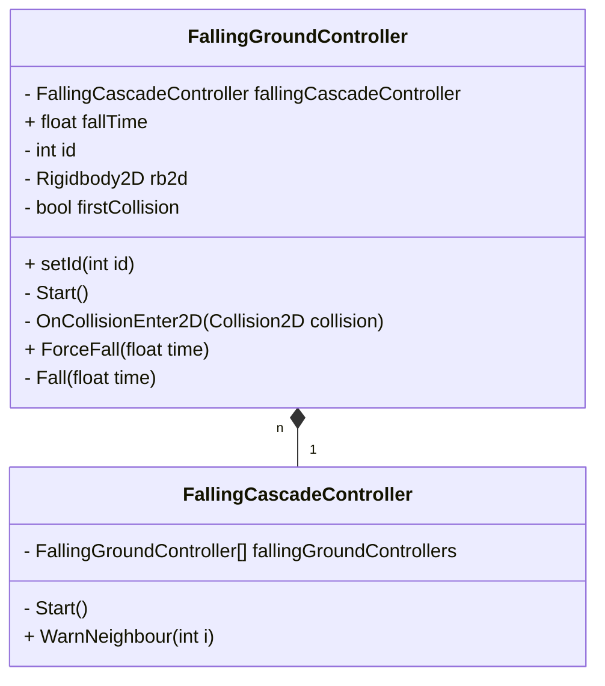

```mermaid
classDiagram

FallingGroundController "n" *-- "1" FallingCascadeController

class FallingGroundController{
    - FallingCascadeController fallingCascadeController
    + float fallTime
    - int id
    - Rigidbody2D rb2d
    - bool firstCollision
    + setId(int id)
    - Start()
    - OnCollisionEnter2D(Collision2D collision)
    + ForceFall(float time)
    - Fall(float time)
}
class FallingCascadeController{
    - FallingGroundController[] fallingGroundControllers
    - Start()
    + WarnNeighbour(int i)
}
```