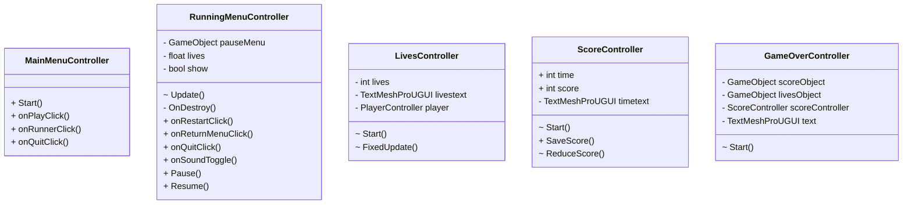

```mermaid
classDiagram

class MainMenuController{
    + Start()
    + onPlayClick()
    + onRunnerClick()
    + onQuitClick()
}
class RunningMenuController{
    - GameObject pauseMenu
    - float lives
    - bool show
    ~ Update()
    - OnDestroy()
    + onRestartClick()
    + onReturnMenuClick()
    + onQuitClick()
    + onSoundToggle()
    + Pause()
    + Resume()
}
class LivesController{
    - int lives
    - TextMeshProUGUI livestext
    - PlayerController player
    ~ Start()
    ~ FixedUpdate()
}
class ScoreController{
    + int time
    + int score
    - TextMeshProUGUI timetext
    ~ Start()
    + SaveScore()
    ~ ReduceScore()
}
class GameOverController{
    - GameObject scoreObject
    - GameObject livesObject
    - ScoreController scoreController
    - TextMeshProUGUI text
    ~ Start()
}
```