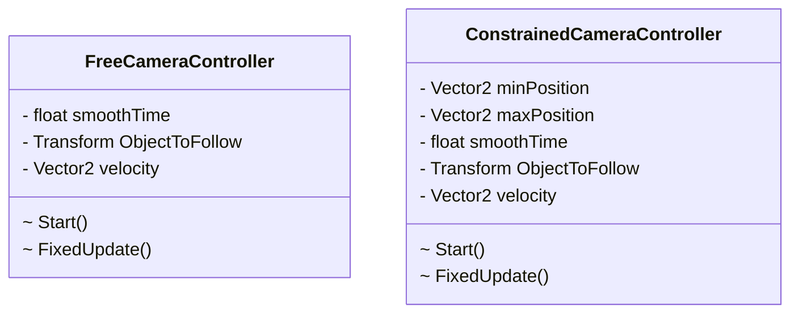

```mermaid
classDiagram

class FreeCameraController {
    - float smoothTime
    - Transform ObjectToFollow
    - Vector2 velocity
    ~ Start()
    ~ FixedUpdate()
}
class ConstrainedCameraController{
    - Vector2 minPosition
    - Vector2 maxPosition
    - float smoothTime
    - Transform ObjectToFollow
    - Vector2 velocity
    ~ Start()
    ~ FixedUpdate()
}
```
