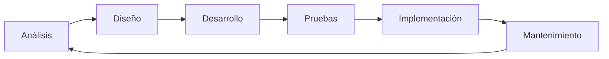
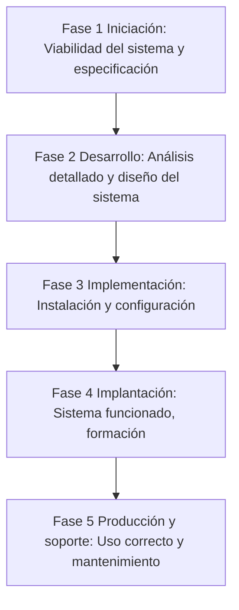

# T4. Implantación de sistemas ERP en la empresa

## 4.1 Metodología de implantación 
Cuando se comienza un nuevo proyecto de implantación se debe realizar un proceso estructurado para el correcto desarrollo del producto. Este proceso es lo que llamamos la metodología de implantación, que debe ser un procedimiento ordenado y fiable. Vamos a definir una metodología basada en el ciclo de la vida clásico, y adaptaremos esta implantación de un proyecto informático dentro del sistema ERP.
Para ello vamos a usar herramientas comunes, como los diagramas de flujo de datos, generando documentación pertinente para llevar a cabo la implementación.

El ciclo de vida clásico se inicia con una fase de análisis donde se va a determinar todas las características clásicas del proyecto. Se van a poner límites y a definir las metas. Como salida de esta fase llevará el diseño del sistema tanto a nivel físico como a nivel lógico.

Crearemos así la documentación técnica suficiente para poder realizar el desarrollo. En esta fase tendremos que definir los elementos funcionales. fuentes, salidas de datos, etc.

Una vez diseñado pasaremos a la fase de desarrollo. En la fase de desarrollo se va a crear el código de la aplicación y se probaran todos los procesos que formen esta. Una vez finalizada la programación se realizará una serie de pruebas de integración entre los distintos elementos de forma que se asegure el correcto funcionamiento de todos los módulos.

Con el software probado se implantará en la empresa asegurando el funcionamiento de todos los módulos. Después de la migración de los datos (si procede) se dará formación a los usuarios y se realizarán las pruebas finales que validarán los requerimientos iniciales. Una vez implementado se lanzará la fase de mantenimiento

### Fases de la metodología general

#### Fase 1 Iniciación: Viabilidad del sistema y especificación
Tiene como finalidad determinar al mas alto nivel los requerimientos del cliente. También determinará como se va a desarrollar en el tiempo. En esta fase se asentarán las bases para tener el proyecto bajo control.
1. Estudiar el ámbito del proyecto:
   
   > Entrada: -
   
   En esta subfase se reúne con el cliente y es donde hay que estudiar la viabilidad del proyecto de forma que se pueda cancelar el proyecto a tiempo antes de empezar a gastar recursos. 
   
   Se va a establecer a un alto nivel qué es lo que se quiere hacer en la aplicación. para ello se harán reuniones con el cliente. Deberá haber además una planificación con el personal técnico, realizando reuniones con ellos, de forma que sean capaces de describir el proceso productivo actual y describir los cambios a introducir hasta que tengamos una vision clara de lo que desea el cliente y qué partes se van a ver aceptadas. Deberíamos poder hacer estimaciones de los cambios que se van a producir en la empresa y como afectarán a esta. De como se realice esta fase va a depender el resultado de la fase siguiente.
   
   Como salida esta fase generará un informe con las necesidades expresadas por el cliente y la fecha de finalización del proyecto. Tendremos además una relación de componentes de la empresa que se verán afectados y el cómo se verán afectados

   > Salida: Informe de necesidades expresadas por el cliente, Informe de relaciones de componentes.

2. Realizar el estudio de viabilidad económica, técnica y organizativa:
   
   > Entrada: Informe de necesidades expresadas por el cliente, Informe de relaciones de componentes.

   Como documento de entrada de esta fase tenderemos el informe de necesidades expresadas por el cliente y el informe de relaciones de componentes, ambos de la fase anterior. Esta es la fase mas importante a nivel económico ya que determinará si sale adelante o no la propuesta. Junto a la documentación de entrada se han de realizar estudios detallados de la empresa a nivel económico para comprobar su solvencia. Deberemos prestar atención a las prestaciones organizativas que se tendrán que realizar durante el proyecto y si son asumibles por el personal.

   Con todo esto se generará un informe pertinente que nos servirá de base para determinar la viabilidad del proyecto. En caso de desestimación del proyecto se creará un documento que justifique los motivos por los que el proyecto ha sido desestimado. En caso de que el cliente acepte el presupuesto se redactará un precontrato que formalice todo lo hablado. Esta subfase tendrá como salida la propuesta de aceptación o la desestimación del proyecto.

   > Salida: Propuesta de aceptación o desestimación del proyecto

3. Determinar el nivel de cambio del nuevo sistema respecto al original:
   
   > Entrada: Informe de necesidades expresadas por el cliente

   En esta fase se profundizará mas sobre qué partes van a cambiar en la empresa de forma que se determinen todos los procesos productivos que se verán afectados. En esta subfase se buscará un máximo nivel de detalle de forma que se consiga estimar a bajo nivel la duración del proyecto. En esta fase tendremos como salida el informe de cambios necesarios detallado.

   > Salida: Informe de cambios necesarios detallado

4. Organizar y planear el proyecto:
   
   > Entrada: Informe de cambios necesarios

   Tendremos como entrada el informe de cambios necesarios de la fase anterior. Los diagramas de flujo de datos son las herramientas mas comunes usadas en los entornos de desarrollo. Son representaciones gráficas de los procesos y de los datos. Estos esquemas tienen un único punto de entrada y un único punto de salida, uniendo todos sus elementos a través de líneas de desplazamiento. En esta subfase crearemos dos documentos, la especificación funcional y el plan de proyecto.

   La especificación funcional explica el funcionamiento empresarial a alto nivel, además de las relaciones existentes entre cada proceso productivo, realizando una estimación de riesgos, costes y beneficios para cada uno de los procesos productivos.

   Partiendo de la especificación funcional dividirá el proyecto en subprocesos independientes determinando su duración, identificando el personal necesario y los requerimientos de requerimientos necesarios para llevarlo a cabo. Realizará además la organización en el tiempo del proyecto con cada una de sus fases.

   Tendremos como salida la especificación funcional del sistema.
   
   > Salida: Especificación funcional del sistema

#### Fase 2 Desarrollo: Análisis detallado y diseño del sistema
La finalidad de esta fase es la de crear el sistema informático completo en papel. Se empezará analizando la especificación funcional ampliando el documento hasta el nivel de detalle mas alto posible. En este nivel de detalle se deberán especificar las entradas y salidas de datos, las modificaciones de estos y las relaciones entre los diferentes elementos. Después se pasará a crear el diseño hardware del sistema, es decir, los ordenadores a usar, conexiones de red, distribución, etc. Después tendremos que definir todos los elementos de software, los módulos a usar dentro del sistema gestor, numero de usuarios y permisos, configuraciones especiales, etc.
1. Análisis detallado:

   > Entrada: Especificación funcional y plan de proyecto

   Tendremos como entrada la especificación funcional y el plan de proyecto. Partiendo de cada uno de los diagramas de flujo se irán desarrollando cada uno de ellos hasta bajar al último nivel, es decir, determinar absolutamente todos los requerimientos de cada uno de los procesos. Esto lo realizaremos de forma  iterativa asegurándonos en cada pasado que las descripciones que estemos creando cumplen con las necesidades del cliente.

   El nivel mas descriptivo que debemos añadir a la documentación ha de ser a nivel de datos, en el que relacionaremos todos los datos necesarios para un proceso simple los datos necesarios, orígenes de los mismos, procesos que los usan y destino de dichos datos.

   Como salida de esta subfase tendremos la especificación externa y toda la documentación generada.

   > Salida: Especificación externa y documentación generada

2. Diseño físico del sistema:
   
   > Entrada: Especificación externa y documentación de la subfase anterior

   Tendremos como entrada la documentación de la subfase anterior. La documentación generada anteriormente nos va a servir en este momento para la implementación del sistema. Revisaremos la especificación externa enfocándonos principalmente en la entrada y salida de datos.

   Con las especificaciones determinaremos la estructura física óptima para el sistema teniendo especial cuidado en el diseño de la red. En definitiva, tendremos que definir los equipos y sus capacidades, los servidores a utilizar, sus localizaciones, etc. Con el diseño finalizado comprobaremos el hardware, cual de ese hardware puede ser reutilizado y las necesidades sobre nuevo hardware.

   > Salida: ???

3. Diseño lógico del sistema:
   
   > Entrada: Especificación externa
   
   Con los procesos y datos identificados en la subfase de análisis vamos  a determinar que módulos nan a ser necesario a la hora de instalar el ERP, además de los departamentos existentes y su estructura tendremos también control sobre las necesidades respecto a los usuarios y la organización de estos de forma que podamos implementar la seguridad en el acceso y la gestión de los datos.

   Comprobaremos los informes que incorpora el sistema y generaremos aquellos que nos hagan falta. En esta fase además va a ser necesario determinar el resto de software implicado en todos los procesos.

   Con todos los datos crearemos dos documentos que serán: el diseño lógico, cuya función va a ser la de recoger el software necesario y su configuración, y la propuesta de compra, que deberemos presentar al cliente para su aceptación. 

   > Salida: Diseño lógico y propuesta de compra del software.

4. Revisión de las previsiones:
   
    > Entrada: Plan de proyecto

   En esta subfase, con el diseño ya completo, pasaremos a revisar el plan de proyecto de forma que podamos determinar si se han cumplido con los objetivos temporales. Tenderemos que comprobar si las previsiones que se hicieron en la fase anterior eran acertadas, si notamos alguna desviación respecto al plano original habrá que modificarlo, y demás notificar al cliente de dicha notificación.

   > Salida: Plan de proyecto revisado

#### Fase 3 Implementación: Instalación y configuración
En este punto del proyecto tendremos definido completamente todo nuestro sistema al mas bajo nivel posible, sera el momento de empezar a instalarlo. Comenzaremos comprando todo el hardware correspondiente y pasando a instalar la red. Una vez realizado esto pasaremos a configurar completamente todo el material adquirido. En este punto deberemos de instalar y configurar todo el software relativo a nuestro sistema de gestión.

Esta fase deberá de documentarse completamente desde el comienzo, dotando al equipo de mantenimiento que posteriormente se hara cargo de la información detallada para mantener todo el sistema.
1. Adquisición de hardware:
   
   > Entrada: Diseño físico y sistema de compra

   Una vez aceptada la propuesta de compra se encargará su adquisición recibiendo el material lo antes posible. Con el hardware ya a nuestra disposición, realizaremos la disposición del sistema empezando por la red y terminando por los servidores. Deberemos instalar un sistema operativo y comprobar las comunicaciones. Ene esta subfase deberemos planificar cuidadosamente la migración si procediera. Nunca se va a deber dejar a la empresa sin su sistema informático, por lo que habrá que mantener durante un periodo varios sistemas.

   > Salida: -

2. Desarrollo de software:

   > Entrada: Diseño lógico y propuesta de compra

   Esta subfase comienza con la instalación y configuración de Odoo. Se compran las licencias según las necesidades y requerimientos del cliente y se instala el software. Una vez instalados se deberán añadir los módulos necesarios, posteriormente se generarán los usuarios y asignaremos los roles de seguridad. En esta fase deberemos además modificar las pantallas de entrada y los menús de acuerdo al diseño realizado en las fases anteriores. En esta fase también se deberán modificar las tablas necesarias para adecuarlas a las necesidades del cliente, y comprobaremos por último que los módulos tienen un funcionamiento correcto.

   Después de todo lo anterior realizaremos todo tipo de pruebas para asegurarnos que las modificaciones funcionan correctamente, asegurándonos además que nuestros módulos se integran adecuademente con el sistema. Comprobaremos que todas las modificaciones realizadas se ejecutan correctamente y que los informes y plantillas de salida se generan correctamente. 

   > Salida: -

3. Plan de pruebas
   
   > Entrada: Diseño físico, diseño lógico.

   En el momento de acabar esta subfase deberemos tener un sistema completamente funcional que cumpla con los requisitos expresados en el contrato, y si todo ha ido bien , en el tiempo acordado. Es imprescindible realizar pruebas de integración de todos los sistemas, de forma que se expondrán y corregirán todos los fallos que empiecen a surgir ahora.

   Empezaremos realizando pruebas de conexión desde los sistemas instalados, haciendo pruebas de acceso, pruebas de seguridad, etc. A bajo nivel miraremos todas las configuraciones que hemos realizado en el sistema operativo y en el sistema gestor. Una vez que comprobamos el hardware y su integración con Odoo pasaremos a realizar pruebas de funcionamiento del sistema gestor. Dichas pruebas incluirán el conjunto de los procesos productivos de la empresa, asegurándonos que todos y cada uno de ellos funcionan correctamente y no hay inconsistencias.

   El conjunto de las pruebas se va a realizar de forma ordenada, generando previamente un plan de pruebas que posteriormente sera llevado a cabo. Este plan incluirá las pruebas a hacer, los datos a usar y  los resultados a obtener, asegurando de esta manera el correcto funcionamiento

   > Salida: Plan de pruebas y documento de salida aprobado

4. Documentación:

   > Entrada: Diseño físico, diseño lógico, plan de pruebas y toda la documentación anterior

   La tarea de documentación no es un proceso secuencial en el tiempo, sino que se realizara conjuntamente con las otras partes de forma paralela, recogiendo toda la información técnica generada en cada procedimiento, organizándola y preparándola para el cliente. El periodo de documentación se refiere exclusivamente a documentar todos nuestros procesos sobre la instalación, configuración y modificación del sistema, y estarán fuera las tareas de formación dentro de la etapa de documentación.

   El fin último de esta etapa es dotar de un mecanismo fiable y eficiente que valga como referencia para la fase de mantenimiento y de soporte.

   Con toda esta documentación se creara un conjunto de carpetas organizadas por fases y ordenadas en el tiempo  facilitando de esta manera el acceso a la información.

   > Salida: Manuales para el uso de las aplicaciones y documentación técnica del sistema

#### Fase 4 Implantación: Sistema funcionado, formación
Pasaremos ahora a incorporar el sistema gestor en la empresa. Dicha empresa asumirá el control de las funciones especificadas en el contrato y comprobaremos que todo funciona correctamente. Para que la implantación sea adecuada, se ha de formar correctamente a todos los usuarios, dando además un soporte inicial. Se ha de supervisar el funcionamiento del sistema y se ha de migrar y adaptar los datos anteriores al nuevo entorno. Terminaremos comprobando que todo funciona correctamente gracias a unas pruebas determinadas por el cliente con las que demostraremos que el trabajo esta terminado.
1. Plan de implantación:
   
   > Entrada: Toda la documentación anterior
   
   Tenemos que especificar exactamente y dentro de la horquilla temporal proporcionada por el plan de proyecto toda la documentación organizativa de la implantación.

   Debemos crear un plan de implantación. En este se va a especificar cada elemento funcional del sistema, que dirá cuándo y cómo se pondrán en marcha. T

   Tendremos además un documento de plan de formación para todo aquel que tenga que interactuar con el nuevo sistema, de forma que crearemos la formación para los empleados. A su vez deberemos generar el plan de formación para los directivos y demás perfiles de la organización, de forma que no excluyamos a nadie ni a ninguna tarea.
   
   Por último, vamos a organizar la migración y conversión de los datos existentes. Debemos integrar todos los datos anteriores en el nuevo sistema, asegurándonos que son consistentes y que no falla nada. Como salida tendremos el plan de implantación, plan de formación y plan de migración.

   > Salida: Plan de implantación, plan de formación y plan de migración

2. Implantación
   
   > Entrada: Plan de implantación

   Seguiremos el plan de implantación para realizar la implantación.

   > Salida: -

3. Formación
   
   > Entrada: Plan de formación
   
   En esta subfase seguiremos escrupulosamente el plan de formación, y dicha formación se va a poder impartir tanto en la empresa como fuera de ella.

   > Salida: -

4. Conversión y migración de datos

   > Entrada: Plan de migración y conversión
   
   La migración de los datos es una de las tareas mas delicadas a llevar a cabo. Debemos de entender que si partimos de unos datos erróneos, el sistema nunca llagará a funcionar correctamente. La migración se ha de hacer antes de cualquier uso previo al sistema, y la implementación de esta subfase se puede hacer mediante la implantación del siguiente mecanismo: Primero lanzaremos un sistema con pocos usuarios con información nueva, y seguiremos con ambos sistemas corriendo en paralelo.

   De esta manera, si se detectan fallos, se puede seguir la producción. Una vez asegurado el proceso, añadiremos poco a poco mas usuarios al sistema, e iremos abandonando al sistema antiguo hasta completar la implantación.

   > Salida: -

5. Test de aceptación

   > Entrada: Pruebas a realizar

   En este test se involucrará al personal de la empresa con capacidad de decisión (dirección), llevándose a cabo todo tipo de pruebas propuestas por el cliente para comprobar que todo funciona correctamente. Si el resultado es satisfactorio, se firmará el documento de finalización del trabajo.

   > Salida: Documento de aceptación del sistema

#### Fase 5 Producción y soporte: Uso correcto y mantenimiento
En la fase de producción y soporte el producto ya ha llegado a su fin, se han cumplido las expectativas y los tiempos produciendo un sistema funcional. A partir de este punto, queda solo pendiente la realización del traspaso de documentación.

En las entrevistas finales se proporcionará todo el material y documentación disponible al cliente.

Con esta fase abrimos un periodo largo de operación

Entenderemos como operación normal y soporte como los procesos dedicados a asegurar que los sistemas sigan funcionando, y que los usuarios funcionen de forma correcta.

Definiremos mantenimiento como las modificaciones mínimas del sistema a través del tiempo. Dichas modificaciones serán producidas o bien por detección de algún error o por una nueva necesidad. Estos cambios deben realizarse asegurándose que no se ven afectadas otras partes del sistema.

Dependiendo del contrato nos veremos o no involucrados en esta fase. Si no se ha contratado con nosotros el mantenimiento y el soporte, daremos por terminada nuestra relación con el cliente, realizando una nueva auditoría del sistema para comprobar que todo funciona correctamente. Si incorporamos el soporte al contrato, deberemos implementar los mecanismos de comunicación y resolución problemas. 

Esta fase es tan importante como las demás para mantener el sistema en un estado correcto. Los errores que se presentan durante este periodo se tendrán que resolver en un tiempo menor que el utilizado para el desarrollo. Hay que saber que el número de errores que aparecen aumenta con el paso del tiempo, aumentando la dificultad de la solución, por lo que llegará un determinado momento donde será necesario plantearse la realización de un nuevo sistema.

1. Operación normal
2. Soporte
3. Mantenimiento
4. Documentación para el cliente